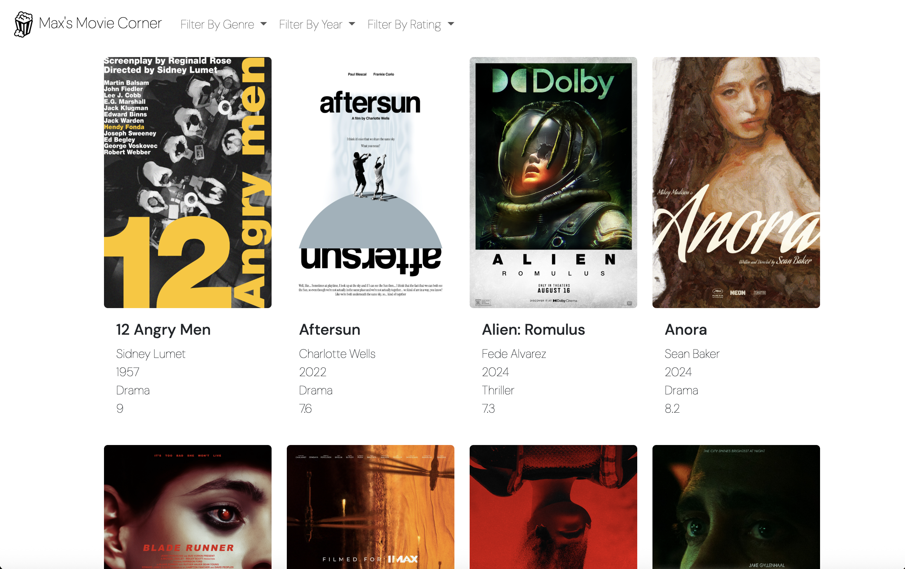

# Max's Movie Corner

Max’s Movie Corner, is a one-page site where the user receives a card list of movies with information such as movie title, year, director etc. and they can filter the movies based on genre, year or rating. The movie cards are also clickable, linking to trailers of each movie.

# Features

- Filter movies by genre, release year, and IMDb rating
- Click movie posters to watch trailers in a new tab
- Browse a selection of visually striking movie posters displayed in a clean, responsive card layout

# Screenshots

_Home Page_

# How To Implement This Project Yourself

- Import the HTML, CSS, JS and JSON files into your development environment
- Fill in the JSON file with your nominated films, and links to their related trailers
- Store your film posters in a seperate 'images' folder

# Tech Stack

- HTML5 – Markup structure
- CSS3 – Custom styling
- JavaScript (ES6) – DOM manipulation and data handling
- Bootstrap 5 – Responsive layout and components
- JSON – Local movie dataset for rendering content
- Fetch API – For dynamically loading movie data

# Contact

Created by Max Wilkinson
[Github](https://github.com/wilkofm) | [LinkedIn](https://www.linkedin.com/in/max-wilkinson-b35aa29b/)
